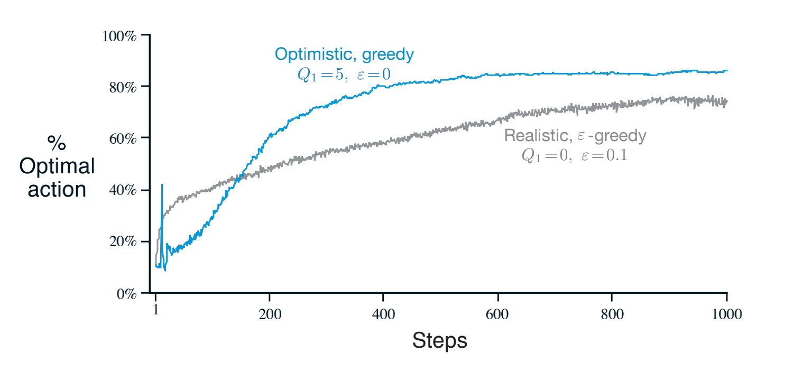

## Lesson 1: The K-Armed Bandit Problem

### Define reward
In the k-armed bandit problem, each of the k actions has an expected or mean reward given that that action is selected; let us call this the **value** of that action. We denote the action selected on time step t as $A_t$, and the corresponding reward as $R_t$. The value then
of an arbitrary action a, denoted $q\ast(a)$, is the expected reward given that a is selected:

$$q\ast(a) = \mathbb{E} [R_t | A_t = a ]$$

We denote the estimated value of action a at time step t as $Q_t(a)$. We would like $Q_t(a)$ to be close
to $q\ast(a)$.

### Understand the temporal nature of the bandit problem


### Define k-armed bandit

Consider the following learning problem. You are faced repeatedly with a choice among k di↵erent options, or actions. After each choice you receive a numerical reward chosen from a stationary probability distribution that depends on the action you selected. Your objective is to maximize the expected total reward over some time period, for example, over 1000 action selections, or time steps.

### Define action-values

We begin by looking more closely at methods for estimating the values of actions and for using the estimates to make action selection decisions, which we collectively call action-value methods.


## Lesson 2: What to Learn? Estimating Action Values

### Define action-value estimation methods

One natural way to estimate this is by averaging the rewards
actually received:

$$Q_t(a) = \frac{\text{sum of rewards when a taken prior to t} }{\text{ number of times a taken prior to t} }$$


### Define exploration and exploitation

If you maintain estimates of the action values, then at any time step there is at least one action whose estimated value is greatest. We call these the greedy actions. When you select one of these actions, we say that you are **exploiting** your current knowledge of the values of the actions. If instead you select one of the nongreedy actions, then we say you are **exploring**, because this enables you to improve your estimate of the nongreedy action’s value.

Exploitation is the right thing to do to maximize the expected reward on the one step, but exploration may produce the greater total reward in the long run.


### Select actions greedily using an action-value function

$$A_t = argmax_a Q_t(a)$$

### Define online learning

$$Q_n = \frac{ R_1 + R_2 + \cdots + R_{n-1} }{ n - 1 }$$

The obvious implementation would be to maintain a record of all the rewards and then perform this computation whenever the estimated value was needed. However, if this is done, then the memory and computational requirements would grow over time as more rewards are seen. Each additional reward would require additional memory to store it and additional computation to compute the sum in the numerator.

As you might suspect, this is not really necessary. It is easy to devise incremental formulas for updating averages with small, constant computation required to process each new reward.

$$Q_(n+1) = Q_n + \frac{1}{n}[ R_n - Q_n ]$$


### Define the general online update equation

$$\text{NewEstimate} = \text{OldEstimate} + \text{StepSize} [ \text{target} - \text{OldEstimate} ]$$


### Understand why we might use a constant stepsize in the case of non-stationarity

The averaging methods discussed so far are appropriate for stationary bandit problems, that is, for bandit problems in which the reward probabilities do not change over time. As noted earlier, we often encounter reinforcement learning problems that are effectively nonstationary. In such cases it makes sense to give more weight to recent rewards than to long-past rewards. One of the most popular ways of doing this is to use a constant step-size parameter.

$$Q_(n+1) = Q_n + \alpha [ R_n - Q_n ]$$

where the step-size parameter $ \alpha \in (0, 1]$ is constant.


$$Q_{n+1} = (1 - \alpha)^n Q_1 + \sum^{n}_{i=1}\alpha(1 - \alpha)^{n-i}R_i $$

Note that the weight, $\alpha(1 - \alpha)^{n-i}$ given the reward $R_i$ depends on how many rewards ago, $n-1$ it was observed. The quantity $1-\alpha$
is less than 1, and thus the weight given to $R_i$ decreases as the number of intervening rewards increases.


## Lesson 3: Exploration vs. Exploitation Tradeoff

### Define epsilon-greedy

Greedy action selection always exploits current
knowledge to maximize immediate reward; it spends no time at all sampling apparently inferior actions to see if they might really be better. A simple alternative is to behave greedily most of the time, but every once in a while, say with small probability $\alpha$ instead select randomly from among all the actions with equal probability, independently of the action-value estimates.  We call methods using this near-greedy action selection rule $\apha$-greedy methods.

```python
current_action = argmax(self.q_values) if _ >= self.epsilon else np.random.randint(0,len(self.q_values))
```

### Understand optimistic initial values, Describe the benefits of optimistic initial values for early exploration

Initial action values can also be used as a simple way to encourage exploration. Suppose that instead of setting the initial action values to zero, as we did in the 10-armed testbed,we set them all to +5. Recall that the $q\ast(a)$ in this problem are selected from a normal distribution with mean 0 and variance 1. An initial estimate of +5 is thus wildly optimistic. But this optimism encourages action-value methods to explore. Whichever actions are initially selected, the reward is less than the starting estimates; the learner switches to other actions, being **disappointed** with the rewards it is receiving. The result is that all actions are tried several times before the value estimates converge. The system does a fair amount of exploration even if greedy actions are selected all the time.




### Explain the criticisms of optimistic initial values

We call this technique for encouraging exploration optimistic initial values. We regard it as a simple trick that can be quite effective on stationary problems, but it is far from being a generally useful approach to encouraging exploration. For example, it is not well suited to nonstationary problems because its drive for exploration is inherently temporary. If the task changes, creating a renewed need for exploration, this method cannot help. Indeed, any method that focuses on the initial conditions in any special way is unlikely to help with the general nonstationary case. The beginning of time occurs only once, and thus we should not focus on it too much. This criticism applies as well to the sample-average methods, which also treat the beginning of time as a special event, averaging all subsequent rewards with equal weights.

### Describe the upper confidence bound action selection method

It would be better to select among the non-greedy actions according to their potential for actually being optimal, taking into account both how close their estimates are to being maximal and the uncertainties in those estimates.One effective way of doing this is to select actions according to

$$A_t = argmax_a [ Q_t(a) + c\sqrt{\frac{\ln t}{ N_t(a)}} ]$$


### Define optimism in the face of uncertainty

The idea of this upper confidence bound (UCB) action selection is that the square-root term is a measure of the uncertainty or variance in the estimate of a’s value  The quantity being max’ed over is thus a sort of upper bound on the possible true value of action $a$, with $c$ determining the confidence level. Each time $a$ is selected the uncertainty is presumably reduced: $N_t(a)$ increments, and, as it appears in the denominator, the uncertainty term decreases. On the other hand, each time an action other than a is selected, $t$ increases but $N_t(a)$ does not; because $t$ appears in the numerator, the uncertainty estimate increases. The use of the natural logarithm means that the increases get smaller over time, but are unbounded; all actions will eventually be selected, but actions with lower value estimates,or that have already been selected frequently, will be selected with decreasing frequency over time.