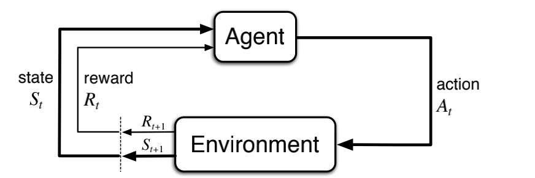

## Lesson 1: Introduction to Markov Decision Processes

### Understand Markov Decision Processes, or MDPs

MDPs are a classical formalization of sequential decision making, where actions influence not just immediate rewards, but also subsequent situations, or states, and through those future rewards.

### Understand the graphical representation of a Markov Decision Process

MDPs are meant to be a straightforward framing of the problem of learning from interaction to achieve a goal. The learner and decision maker is called the agent. The thing it interacts with, comprising everything outside the agent, is called the environment. These interact continually, the agent selecting actions and the environment responding to these actions and presenting new situations to the agent.1 The environment also gives rise to rewards, special numerical values that the agent seeks to maximize over time
through its choice of actions.

    
    
The agent–environment interaction in a Markov decision process.

### Describe how the dynamics of an MDP are defined

In a finite MDP, the sets of states, actions, and rewards (S, A and R) all  have a finite number of elements. In this case, the random variables $R_t$ and $S_t$ have well defined
discrete probability distributions dependent only on the preceding state and action. That is, for particular values of these random variables, $s\prime \in S$ and $r \in R$, there is a probability of those values occurring at time t, given particular values of the preceding state and action:

$$p(s\prime, r | s, a) = Pr\{S_t = s\prime, R_t = r | S_{t-1} = s, A_{t-1} = a \}$$

$$\sum_{s\prime \in s}\sum_{r \in R} p(s\prime, r | s, a) = 1, \text{for all} \, s\in S, a \in A_{(s)}$$

for all $s\prime, s \in S, r \in R \text{and} a \in A_{(s)}$.  The function p defines the dynamics of the MDP. The dot over the equals sign in the equation reminds us that it is a definition (in this case of the function p) rather than a fact that follows from previous definitions. The dynamics function $p: S x R x S x A \rightarrow [0, 1]$ is an ordinary deterministic function of four arguments.

In a Markov decision process, the probabilities given by p completely characterize the environment’s dynamics. That is, the probability of each possible value for $S_t$ and $A_t$, and, given them, not at all on earlier states and actions. This is best viewed a restriction not on the decision process, but on the state.  The state must include information about all aspects of the past agent–environment interaction that make a di↵erence for the future. If it does, then the state is said to have the Markov property.

From the four-argument dynamics function, p, one can compute anything else one might want to know about the environment, such as the **state-transition probabilities** (which we denote, with a slight abuse of notation, as a three-argument function
$p: S x S x A \rightarrow [0, 1]$)

$$p(s\prime | s, a) = Pr\{S_t = s\prime | S_{t-1} = s, A_{t-1} = a \} = \sum_{r \in R}p(s\prime, r | s, a)$$

We can also compute the expected rewards for state–action pairs as a two-argument function $r : S x A \rightarrow \mathbb{R}$

$$r(s,a) = \mathbb{R} [R_t | S_{t-1} = s, A_{t-1} = a] = \sum_{r \in R} r \sum_{s\prime \in S} p(s\prime, r | s, a)$$

and the expected rewards for **state–action–next-state** triples as a three-argument function $r: S x A x S \rightarrow \mathbb{R}$

$$r(s,a,s\prime) = \mathbb{E} [R_t | S_{t-1} = s, A_{t-1} = a, S_t = s\prime] = \sum_{r \in R} r \frac{ p(s\prime, r | s, a) }{p(s\prime | s, a)}$$

### Explain how many diverse processes can be written in terms of the MDP framework

The MDP framework is abstract and flexible and can be applied to many di↵erent problems in many di↵erent ways.  

- In general, actions can be any decisions we want to learn how to make, and
the states can be anything we can know that might be useful in making them. 
- The general rule we follow is that anything that cannot be changed arbitrarily by the agent is considered to be outside of it and thus part of its environment.  
- The agent–environment boundary represents the limit of the agent’s absolute control, not of its knowledge.

The MDP framework is a considerable abstraction of the problem of goal-directed learning from interaction. It proposes that whatever the details of the sensory, memory, and control apparatus, and whatever objective one is trying to achieve, any problem of learning goal-directed behavior can be reduced to three signals passing back and forth between an agent and its environment: one signal to represent the choices made by the agent (the **actions**), one signal to represent the basis on which the choices are made (the **states**), and one signal to define the agent’s goal (the **rewards**).

## Lesson 2: Goal of Reinforcement Learning

### Describe how rewards relate to the goal of an agent

Informally, the agent’s goal is to maximize the total amount of reward it receives. This means maximizing not immediate reward, but cumulative reward in the long run. We can clearly state this informal idea as the reward hypothesis:

> That all of what we mean by goals and purposes can be well thought of as the maximization of the expected value of the cumulative sum of a received scalar signal (called reward).

### Understand episodes and identify episodic tasks

when the agent–environment interaction breaks naturally into **subsequences**, which we call episodes,7 such as plays of a game, trips through a maze, or any sort of repeated interaction. Each episode ends in a special state called the **terminal state**, followed by a **reset** to a standard starting state or to a sample from a standard distribution of starting states.

In general, we seek to maximize the expected return, where the return, denoted $G_t$,  is defined as some specific function of the reward sequence. In the simplest case the return is the sum of the rewards:

$$G_t = R_{t+1} + R_{t+2} + R_{t+3} + \cdots + R_{T}$$

where T is a final time step.

## Lesson 3: Continuing Tasks

### Formulate returns for continuing tasks using discounting

In many cases the agent–environment interaction does not break naturally into identifiable episodes, but goes on continually without limit.  For example, this would be the natural way to formulate an on-going process-control task, or an application to a robot with a long life span. We call these continuing tasks. The return formulation is problematic for continuing tasks because the final time step would be $T = \infty$ and the return, which is what we are trying to maximize, could itself easily be infinite.

The additional concept that we need is that of **discounting**. According to this approach, the agent tries to select actions so that the sum of the discounted rewards it receives over the future is maximized. In particular, it chooses $A_t$ to maximize the expected discounted return:

$$G_t = R_{t+1} + \eta R_{t+2} + \eta^2 R_{t+3} + \cdots  = \sum_{k=0}^{\infty} \eta^k R_{t+k+1}$$

where \eta is a parameter, $ 0 \leq \eta \leq 1$, called the discount rate.

The discount rate determines the present value of future rewards: a reward received k time steps in the future is worth only $\eta^{k-1}$ times what it would be worth if it were received immediately. If $\eta < 1$, the infinite sum has a finite value as long as the reward sequence $\{ R_k \}$ is **bounded**.

Returns at successive time steps are related to each other in a way that is important for the theory and algorithms of reinforcement learning:

$$G_t =  R_{t+1} + \eta (R_{t+2} + \eta R_{t+3} + \eta^2 R_{t+4} + \cdots) = R_{t+1} + \eta G_{t+1}$$

### Describe how returns at successive time steps are related to each other

If $\eta = 0$, the agent is “myopic” in being concerned only with maximizing immediate rewards: its objective in this case is to learn how to choose At so as to maximize only $R_{t+1}$. If each of the agent’s actions happened to influence only the immediate reward, not future rewards as well, then a myopic agent could maximize by separately maximizing each immediate reward. But in general, acting to maximize immediate reward can reduce access to future rewards so that the return is reduced. As $\eta$ approaches 1, the return objective takes future rewards into account more strongly; the agent becomes more farsighted.