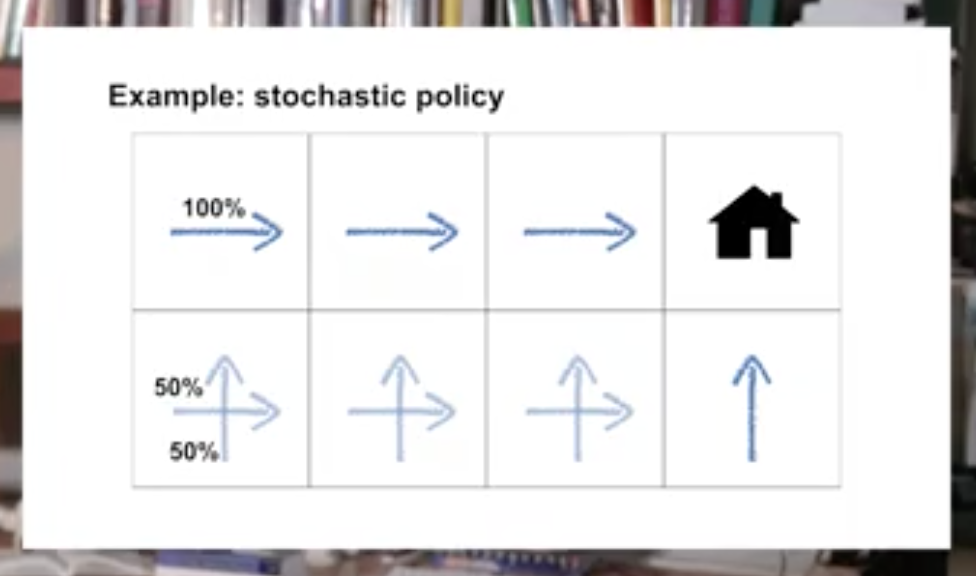
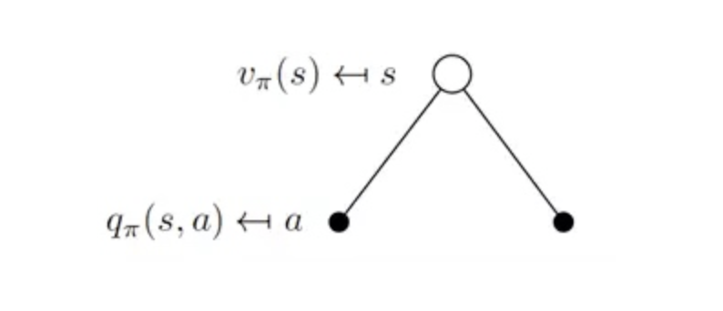
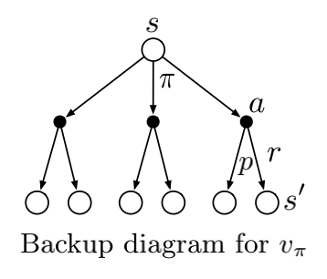

## Lesson 1: Policies and Value Functions

### Recognize that a policy is a distribution over actions for each possible state.

a policy is a mapping from states to probabilities of selecting each possible action.  If the agent is following policy $\pi$ at time $t$, then $\pi(a | s)$ is the probability that $A_t = a$ if $S_t = s$

### Describe the similarities and differences between stochastic and deterministic policies

Deterministic policies: a policy assigns probabilities to each action in each state.

Stochastic policy: a policy where multiple actions may be selected with non-zero probability.

    

    

### Identify the characteristics of a well-defined policy

- An agent's behavior is specified by a policy that maps the state to a probability distribution over actions
- The policy can depend only on the current state, and not other things like time or previous states. See you next time.

### Describe the roles of state-value and action-value functions in reinforcement learning

Similarly, we define the value of taking action a in state s under a policy $\pi$, denoted $q_{\pi}(s,a)$,  as the expected return starting from $s$,  taking the action a, and thereafter following policy $\pi$:

$$q_{\pi}(s) = \mathbb{E}_{\pi}[ G_t | S_t = s, A_t = a] = \mathbb{E}_{\pi}[ \sum_{k=0}^{\infty} \eta^k R_{t+k+1} | S_t = s, A_t = a ] $$

We call $q_{\pi}$ the action-value function for policy $\pi$.

    
    
the roles of state-value and action-value functions

### Describe the relationship between value functions and policies

Value function enable us to judge the quality of different policies.

The value function of a state s under a policy $\pi$, denoted $V_\pi(s)$, is the expected return when starting in s and following $\pi$ thereafter. For MDPs, we can define $V_{\pi}$ formally by

$$V_{\pi}(s) = \mathbb{E}[ G_t | S_t = s] = \mathbb{E}_{\pi}[ \sum_{k=0}^{\infty} \eta^k R_{t+k+1} | S_t = s ], \text{for all} \quad s \in \mathbb{S}$$

where $\mathbb{E}[\dot]$ denotes the expected value of a random variable given that the agent follows policy $\pi$, and t is any time step.

### Create examples of valid value functions for a given MDP

## Lesson 2: Bellman Equations

### Derive the Bellman equation for state-value functions

$$V_{\pi}(s) = \mathbb{E}[ G_t | S_t = s] = \sum_a \pi (a | s)\sum_{s\prime,r}p(s\prime,r | s, a)[ r + \eta v_{\pi}(s\prime)], \quad \text{ for all } \quad s \in \mathbb{S}$$

### Derive the Bellman equation for action-value functions

$$q_{\pi}(s,a) = \mathbb{E}_{\pi}[ G_t | S_t = s, A_t = a] = \sum_{s\prime}\sum_{r}p(s\prime,r | s, a)[ r + \eta\sum_{a\prime} \pi (a\prime | q_{\pi}(s\prime, a\prime))]$$

### Understand how Bellman equations relate current and future values

    

The current time-step's state/action values can be written recursivelu in terms of future state/action values

Bellman equation for $V_{\pi}$,  It expresses a relationship between the value of a state and the values of its successor states. Think of looking ahead from a state to its possible successor states, as suggested by the diagram to the right. Each open circle represents a state and each solid circle represents a state–action pair. Starting from state s, the root node at the top, the agent could take any of some set of actions—three are shown in the diagram—based on its policy $\pi$.  From each of these, the environment could respond with one of several next states, $s\prime$ (two are shown in the figure), along with a reward, r, depending on its dynamics given by the function $p$. The Bellman equation averages over all the possibilities, weighting each by its probability of occurring. It states that the value of the start state must equal the(discounted) value of the expected next state, plus the reward expected along the way.

We call diagrams like that above backup diagrams because they diagram relationships that form the basis of the update or backup operations that are at the heart of reinforcement learning methods. These operations transfer value information back to a state (or a state–action pair) from its successor states (or state–action pairs)

### Use the Bellman equations to compute value functions

The value function  is the unique solution to its Bellman equation.

## Lesson 3: Optimality (Optimal Policies & Value Functions)

### Define an optimal policy, understand how a policy can be at least as good as every other policy in every state

For finite MDPs, we can precisely define an optimal policy in the following way. Value functions define a partial ordering over policies.  A policy $\pi$ is defined to be better than or equal to a policy $\pi\prime$ if its expected return is greater than or equal to that of $\pi\prime$ for all states.  In other words, $\pi \geq \pi\prime$ if and only if $V_{\pi}(s) \geq V_{\pi\prime}(s)$ for all $s \in \mathbb{S}$. There is always at least one policy that is better than or equal to all other policies. This is an optimal policy. Although there may be more than one, we denote all the optimal policies by $\pi_{\star}$. They share the same state-value function, called the optimal state-value function, denoted $V_{\star}$, and defined as

$$V_{\star} = max_{\pi}V_{\pi}(s) \quad \text{for all} \quad s \in \mathbb{S}$$

Optimal policies also share the same optimal action-value function, denoted $q_{\star}$, and defined as

$$q_{\star}(s,a) = max_{\pi} q_{\pi}(s,a) \quad \text{for all} \quad s \in \mathbb{S} \, \text{and} \, a \in \mathbb{A}(s)$$

For the state–action pair (s, a), this function gives the expected return for taking action $a$ in state $s$ and thereafter following an optimal policy. Thus, we can write $q_{\star}$ in terms of $V_{\star}$ as follows:

$$q_{\star}(s,a) = \mathbb{E}[ R_{t+1} + \eta v_{\star}(S_{t+1}) | S_t = s, A_t = a]$$

### Derive the Bellman optimality equation for state-value functions

$$V_{\star}(s) = \sum_a \pi_{\star} (a | s)\sum_{s\prime,r}p(s\prime,r | s, a)[ r + \eta v_{\star}(s\prime)], \quad \text{ for all } \quad s \in \mathbb{S}$$

$$V_{\star}(s) = max_a \sum_{s\prime,r}p(s\prime,r | s, a)[ r + \eta v_{\star}(s\prime)], \quad \text{ for all } \quad s \in \mathbb{S}$$

### Derive the Bellman optimality equation for action-value functions

$$q_{\star}(s,a) = \sum_{s\prime}\sum_{r}p(s\prime,r | s, a)[ r + \eta\sum_{a\prime} \pi_{\star} (a\prime | q_{\star}(s\prime, a\prime))]$$

$$q_{\star}(s,a) = \sum_{s\prime}\sum_{r}p(s\prime,r | s, a)[ r + \eta max_{a\prime}q_{\star}(s\prime, a\prime))]$$

### Understand the connection between the optimal value function and optimal policies

Once we had the optimal state-value function, it's relatively easy to work out the optimal policy. If we have the optimal action-value function, working out the optimal policy is even easier. This correspondence between optimal-value functions and optimal-policies will help us to derive many of the reinforced learning algorithms we will explore later in this specialization.

